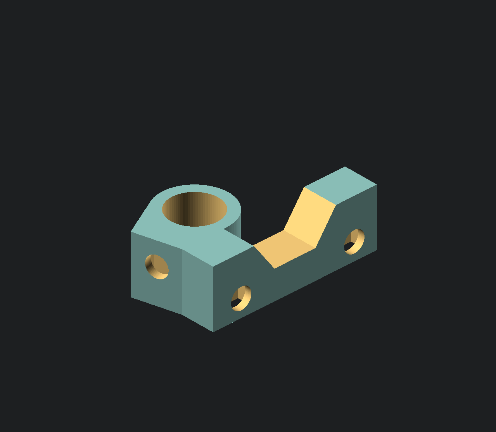
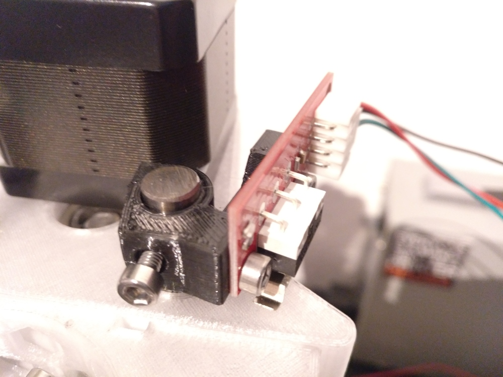
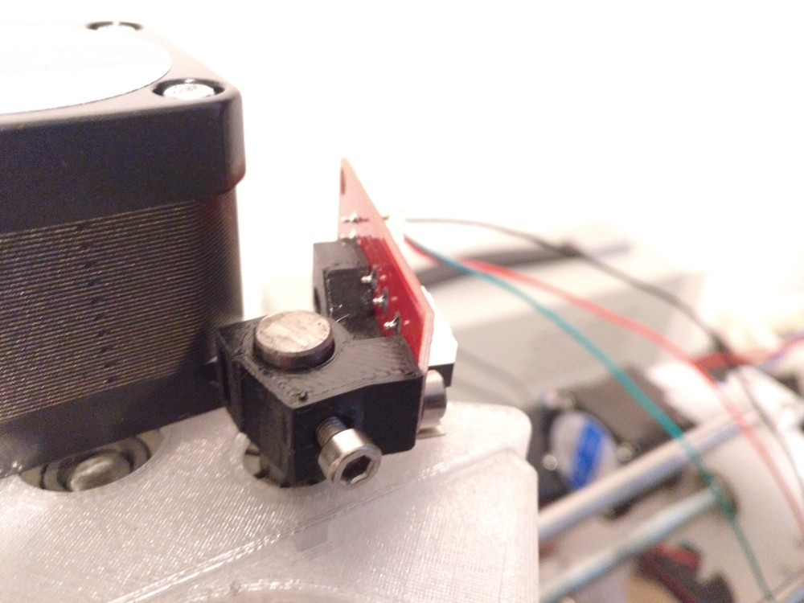

New Z Endstop which gets triggered by the carriage (not directly between the z rods)

using both rods moves rods to much so it stops the carriage from moving properly and stucking at one position (causing limit alarm in grbl when homing)

